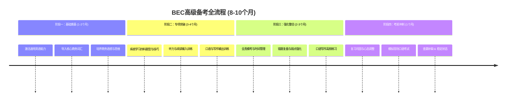

好的，为你量身打造一份从四级水平直达BEC高级的详细备考攻略。这份计划假设你每天能投入2-3小时，周末投入更多时间，总备考周期约为8-10个月。

🗓️ 整体备考路线图

下图清晰地展示了通往BEC高级的完整旅程，它分为四个明确的阶段：

---

📚 第一阶段：基础奠基 (1-2个月)

目标：完成从通用英语到商务英语的转向，激活你的英语能力，并打下坚实的商务词汇和知识基础。

详细步骤与资源：

1. 词汇筑基 (每日坚持)
   · 核心任务：背诵《BEC中级核心词汇》或《BEC高频词汇》。每天50-70个。
   · 方法：使用艾宾浩斯记忆法和扇贝单词/百词斩等APP。更重要的是，在语境中记忆。遇到生词，去例句和文章中理解它。
   · 输出：准备一个单词本，记录生词、搭配和例句。
2. 听力启蒙 (每日坚持)
   · 核心任务：营造商务英语环境。
   · 资源与步骤：
     · 泛听：每天通勤、休息时听BBC Global News Podcast, 《经济学人》系列播客。目标是熟悉语速和语调，不必每个词都听懂。
     · 精听：从BEC中级的听力真题开始。步骤：① 像考试一样听一遍做题；② 逐句听写，直到听懂每一个词；③ 对照原文，跟读模仿。
3. 阅读入门 (每日坚持)
   · 核心任务：接触原汁原味的商务英语文章。
   · 资源与步骤：
     · 每天精读1-2篇 《金融时报》或《经济学人》 的短文章（特别是商业、财经版块）。
     · 方法：第一遍快速阅读抓大意，第二遍细读，划出好的句型和生词，并记录到你的单词本中。
4. 商务知识储备 (每周)
   · 核心任务：了解基本商业运作。
   · 方法：阅读一本《商业入门》书籍的中文版，或关注一些深度的商业公众号。你需要理解什么是市场营销、财务管理、人力资源、企业战略等基本概念。

---

🎯 第二阶段：专项突破 (3-4个月)

目标：系统学习BEC高级的所有题型，掌握解题技巧，并进行分项练习。

必备资源：

· 《新编剑桥商务英语（高级）学生用书》
· 《BEC高级真题集》（第2-5辑）

详细步骤：

1. 系统学习教材
   · 按章节学习《学生用书》，完成书中的所有练习。这本书是你的“教练”，会教你所有题型的解法并提供练习。
2. 分项突破
   · 阅读：
     · 练习真题，重点攻克第二部分（句子填空）和第五部分（长篇阅读）。这两部分最考验逻辑和理解。
     · 技巧：学会找关键词、指代词，理解文章逻辑结构（因果、转折、并列等）。
   · 听力：
     · 开始做高级听力。精听是核心。尤其注意第二部分（独自发言）和第三部分（多人讨论）。
     · 技巧：预读题目、预测内容、注意同义替换（这是BEC考试的灵魂！）。
   · 写作：
     · Part 1 (图表描述)：背诵范文的开头、结尾、趋势描述（上升、下降、平稳）的经典句型。每周写1-2篇。
     · Part 2 (报告/提案/信函)：模仿！模仿！模仿！ 学习范文的格式、结构和语言。报告怎么写，提案怎么提，都有固定套路。每周写1篇，并对照范文修改。
   · 口语：
     · 寻找语伴！ 这是必须的。可以在备考群、语言交换APP上找。
     · Part 1 (自我介绍)：准备一个流畅的模板。
     · Part 2 (迷你演讲)：准备一个1分钟演讲的框架（观点+2个理由+总结）。
     · Part 3 (讨论)：和语伴每周练习2-3次，录音，然后回听，找出“嗯，啊”等口头禅和语法错误。

---

💥 第三阶段：强化整合 (2-3个月)

目标：通过全真模拟考试，整合所有技能，查漏补缺，提升应试能力。

详细步骤：

1. 全真模考 (每周六上午)
   · 找一个安静的环境，严格按照考试时间（阅读60分钟，写作70分钟，听力40分钟）完成一整套真题。
   · 严禁中途休息或超时。这是对你体力和注意力的极限训练。
2. 深度复盘 (每周六下午)
   · 批改：客观题对答案，主观题（写作、口语）对照范文和评分标准自我评估，或请老师/高水平朋友批改。
   · 建立错题本：记录每一道错题，并分析错误原因：是单词不会？语法不清？还是逻辑理解错误？
   · 精听精读：把模考中错的多的听力和阅读文章，拿出来再做一遍精听和精读。
3. 输出强化
   · 写作：形成自己的模板库和句型库。确保在40分钟内能高质量地完成两篇作文。
   · 口语：进行更高强度的模拟。可以尝试找不同的语伴，以适应不同的口音和讨论风格。

---

🏁 第四阶段：考前冲刺 (最后1个月)

目标：调整状态，巩固记忆，增强信心。

详细步骤：

1. 复习为主：停止做新题。反复看你的错题本、词汇本、写作模板和口语素材。
2. 保持手感：每周做1-2套题，保持做题的感觉即可。
3. 口语冲刺：和语伴进行最后几次高强度的模拟，模拟真实考试环境。
4. 生理调节：调整作息，保证睡眠。考试当天才能精力充沛。

💻 程序员专属贴士

1. 利用技术：用Anki记忆卡软件复习词汇；用Grammarly检查写作语法；用Otter.ai录音并转写你的口语练习进行分析。
2. 工作结合：尝试用英语写项目周报或技术笔记，把学到的商务写作技巧用起来。
3. 心态管理：这是一场马拉松。允许自己有状态不好的时候，但要保持持续的努力。记住，你的目标不是完美，而是从“不会”到“会”的进步。

这份计划非常详尽，但关键在于 “坚持执行” 和 “灵活调整” 。现在，你就可以从第一阶段的第一步开始了！祝你成功！
